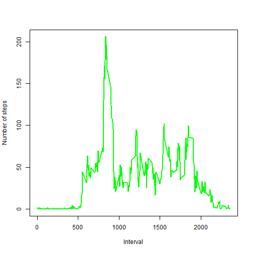
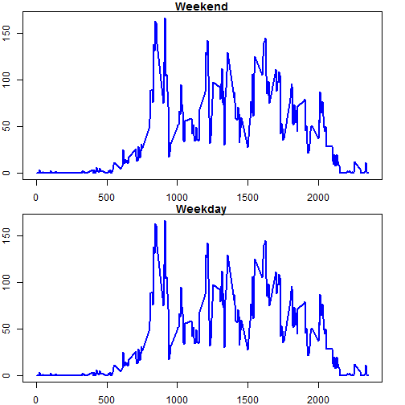

##Loading and preprocessing the data

###Loading data

```r
setwd("D:\\Projects\\training\\DataScience Specilization Certificate\\Reproducible Research")
activity <- read.csv("activity.csv", header=TRUE,sep=",",na.strings="NA", colClasses=c("numeric", "character", "numeric"))
```

###Convert date time data to the corresponding data type

```r
activity$hour <- activity$interval %/% 100
activity$minute <- activity$interval %% 100
activity$datetime <- strptime(paste(activity$date, activity$hour, activity$minute), format="%Y-%m-%d %H %M")
activity$date <- as.Date(activity$date, format="%Y-%m-%d")
```

##What is mean total number of steps taken per day?
###Calculate the total number of steps taken per day

```r
data1 <- aggregate(steps ~ date, activity, sum)
```

###Make a histogram of the total number of steps taken each day

```r
library(ggplot2)
qplot(steps, data = data1)
```

```
## stat_bin: binwidth defaulted to range/30. Use 'binwidth = x' to adjust this.
```

 

###Calculate and report the mean and median of the total number of steps taken per day

```r
mean(data1$steps)
```

```
## [1] 10766.19
```

```r
median(data1$steps)
```

```
## [1] 10765
```

##What is the average daily activity pattern?

###Make a time series plot (i.e. type = "l") of the 5-minute interval (x-axis) and the average number of steps taken, averaged across all days (y-axis)

```r
data2 <- aggregate(steps ~ interval, activity, mean)
plot(data2$interval, data2$steps, type="l", xlab= "Interval", ylab= "Number of steps", col="green" , lwd=2)
```

 

###Which 5-minute interval, on average across all the days in the dataset, contains the maximum number of steps?

```r
with(data2, interval[steps == max(steps)])
```

```
## [1] 835
```

##Imputing missing values


```r
sum(is.na(activity$steps))
```

```
## [1] 2304
```

```r
newActivity <- activity
```

###Missing value at an interval is filled by the average value of steps at this interval


```r
newActivity$steps[which(is.na(newActivity$steps) & match(data2$interval, newActivity$interval))] <- data2$steps
```


```r
data3 <- aggregate(steps ~ date, newActivity, sum)
qplot(steps, data = data3)
```

```
## stat_bin: binwidth defaulted to range/30. Use 'binwidth = x' to adjust this.
```

 

```r
mean(data3$steps)
```

```
## [1] 10766.19
```

```r
median(data3$steps)
```

```
## [1] 10766.19
```

##Are there differences in activity patterns between weekdays and weekends?


```r
newActivity$WEND <- factor(newActivity$datetime$wday == 0 | newActivity$datetime$wday == 6,levels=c(TRUE,FALSE),labels=c("weekend","weekday"))
par(mfrow=c(2,1))
par(mar = c(2, 2, 1, 2))

weekendAct <- aggregate(steps ~ interval, data=subset(newActivity, WEND == "weekend"), mean)
weekdayAct <- aggregate(steps ~ interval, subset(newActivity, WEND == "weekday"), mean)
plot(weekendAct$interval, weekendAct$steps, type="l", main="Weekend", xlab= "Interval", ylab= "Number of steps", col="blue" , lwd=2)
plot(weekdayAct$interval, weekendAct$steps, type="l", main="Weekday", xlab= "Interval", ylab= "Number of steps", col="blue" , lwd=2)
```

 
